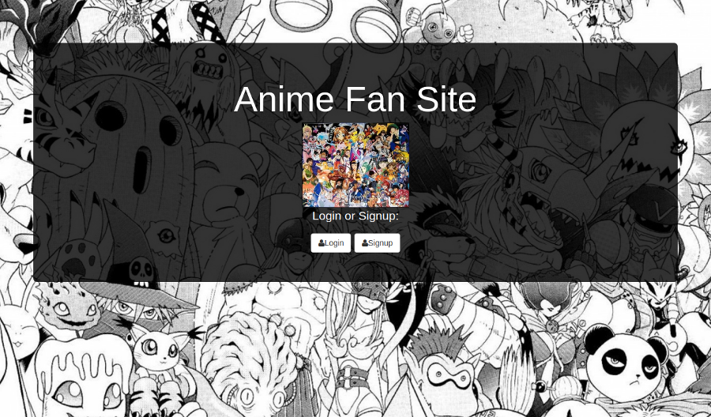
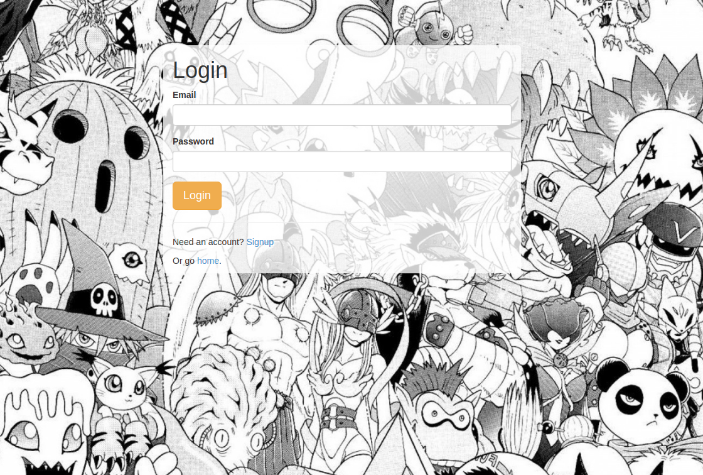
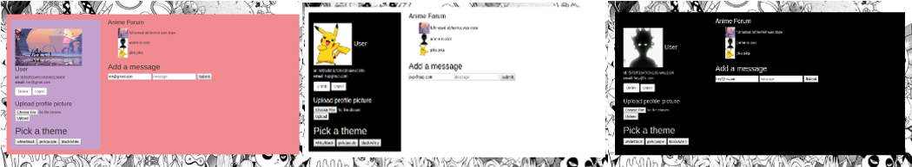

# Fullstack-Anime-Forum

## How It's Made:

**Tech used:** HTML5, CSS3, JavaScript, Node.js, Mongodb, Express, EJS.

## Lessons Learned:
Learned how to display different user profile images from the serverside

## Examples:

Tech Wu-tang Name Generator https://github.com/ericamendez/wu-tang-generator-bootcamp2018c-week08

Card Memory Game https://github.com/ericamendez/matching-card-bootcamp2018c-week08/tree/answer

Complex NASA API https://github.com/ericamendez/complex-nasa-bootcamp2018c-week07
